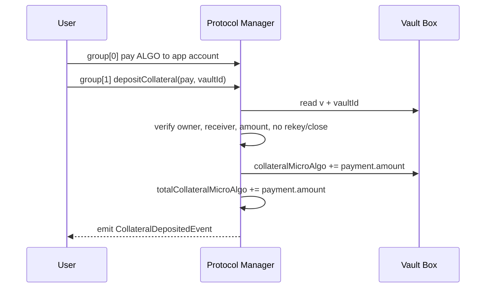
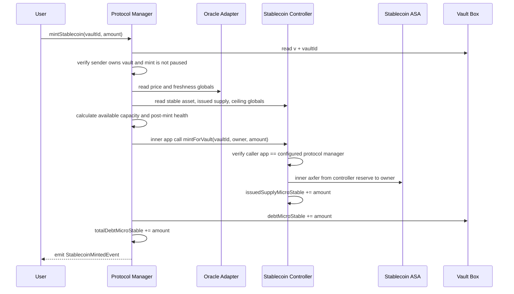
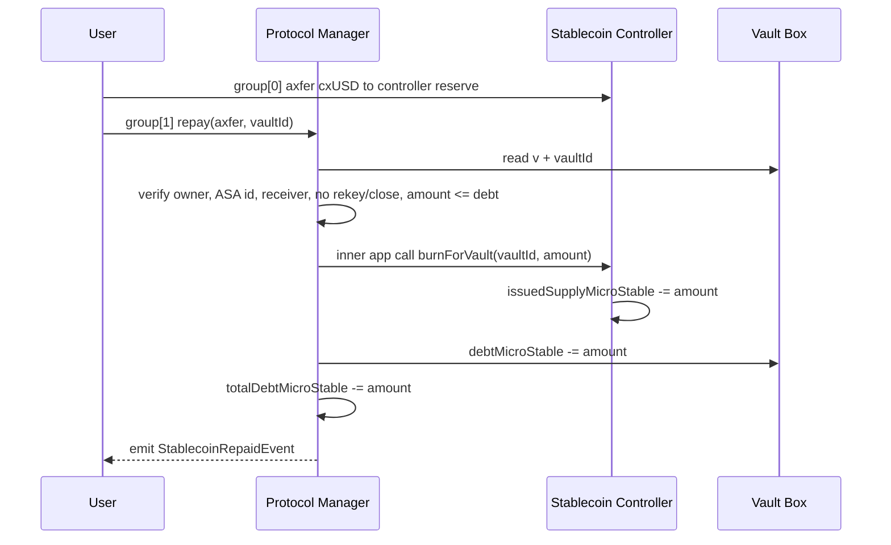
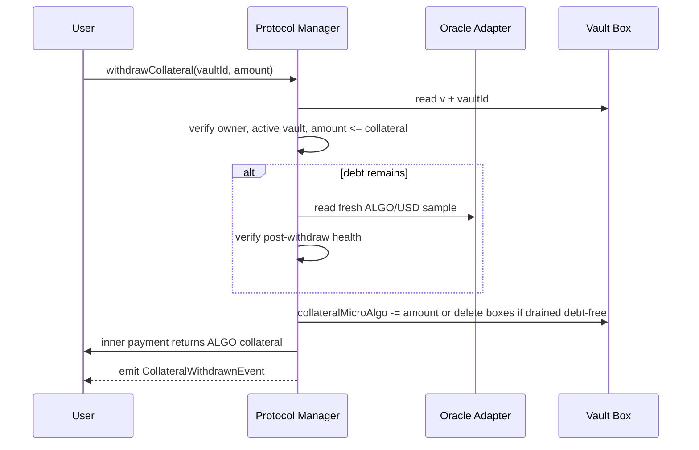
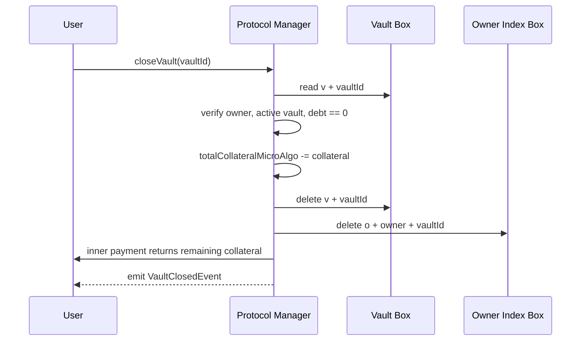

# CollateralX Smart Contract State Layout

This document defines the initial on-chain architecture for the CollateralX
stablecoin protocol. It is intentionally explicit because state layout is the
part of an Algorand application that is hardest to change safely after launch.

## Contract Topology

CollateralX is split into four Algorand TypeScript applications:

| Contract | Responsibility |
| --- | --- |
| `CollateralXProtocolManager` | Owns protocol configuration, aggregate counters, and per-vault records. |
| `CollateralXOracleAdapter` | Stores the canonical ALGO/USD oracle sample consumed by protocol actions. |
| `CollateralXStablecoinController` | Owns stablecoin asset-control configuration and future mint/burn authorization. |
| `CollateralXLiquidationExecutor` | Owns liquidation execution configuration and future keeper-facing liquidation calls. |

The protocol manager is the source of truth for vault data. The other contracts
are intentionally small adapters/controllers so future versions can replace the
oracle, stablecoin controller, or liquidation executor without migrating every
vault box.

## Global State

Global state is used only for bounded protocol-wide values that are required on
nearly every call. This keeps reads cheap and avoids scanning boxes for aggregate
state.

### Protocol Manager Globals

| Key | Type | Reason |
| --- | --- | --- |
| `adm` | `Account` | Admin address used for access control. Global because every privileged method needs it. |
| `init` | `uint64` | One-way initialization guard. Global because it gates all state-changing methods. |
| `nvid` | `uint64` | Next deterministic vault id. Global because ids must be unique and sequential. |
| `vcnt` | `uint64` | Total vaults ever created. Global counter for analytics and keeper pagination. |
| `tdbt` | `uint64` | Aggregate stablecoin debt in micro-units. Global because protocol ceiling checks need O(1) reads. |
| `tcol` | `uint64` | Aggregate collateral in microALGO. Global because dashboard and risk checks need O(1) reads. |
| `mcr` | `uint64` | Minimum collateral ratio in basis points. Global protocol parameter. |
| `lqr` | `uint64` | Liquidation threshold in basis points. Global protocol parameter. |
| `lpn` | `uint64` | Liquidation penalty in basis points. Global protocol parameter. |
| `lbn` | `uint64` | Liquidation bonus in basis points. Global protocol parameter. |
| `ofw` | `uint64` | Oracle freshness window in seconds. Global protocol parameter. |
| `vmcp` | `uint64` | Per-vault mint cap in micro stable units. Global protocol parameter. |
| `pdc` | `uint64` | Protocol debt ceiling in micro stable units. Global protocol parameter. |
| `dflo` | `uint64` | Minimum remaining debt floor in micro stable units. Global protocol parameter. |
| `pflg` | `uint64` | Pause bitmask for selected actions. Global because every action checks it. |
| `oapp` | `uint64` | Oracle adapter app id. Global integration pointer. |
| `sapp` | `uint64` | Stablecoin controller app id. Global integration pointer. |
| `lapp` | `uint64` | Liquidation executor app id. Global integration pointer. |

Pause flag bits:

| Bit | Mask | Action |
| --- | --- | --- |
| 0 | `1` | Deposits paused |
| 1 | `2` | Minting paused |
| 2 | `4` | Repayment paused |
| 3 | `8` | Withdrawals paused |
| 4 | `16` | Liquidations paused |
| 5 | `32` | Vault creation paused |
| 6 | `64` | Emergency pause for all user operations |

### Oracle Adapter Globals

| Key | Type | Reason |
| --- | --- | --- |
| `adm` | `Account` | Admin authorized to update adapter configuration and rotate the trusted updater. |
| `updr` | `Account` | Trusted v1 price updater. Global because every price update checks it. |
| `init` | `uint64` | Initialization guard. |
| `px` | `uint64` | Current ALGO/USD price in microUSD. Global because every consumer needs the latest value. |
| `upd` | `uint64` | UNIX timestamp for the current oracle sample. |
| `urnd` | `uint64` | Algorand round associated with the current sample. Used to reject future or non-monotonic updates. |
| `src` | `bytes` | Short source tag, such as `manual-v0` or an oracle feed id. |
| `maxa` | `uint64` | Maximum permitted sample age in seconds for adapter-level checks. |
| `pflg` | `uint64` | Pause bitmask for adapter updates/reads if governance needs to freeze the feed. |

### Stablecoin Controller Globals

| Key | Type | Reason |
| --- | --- | --- |
| `adm` | `Account` | Admin authorized to configure controller. |
| `init` | `uint64` | Initialization guard. |
| `mgr` | `uint64` | Protocol manager app id authorized for future mint/burn calls. |
| `asa` | `uint64` | Stablecoin ASA id once created or attached. |
| `supply` | `uint64` | Aggregate issued supply controlled by this app. |
| `ceil` | `uint64` | Supply ceiling in micro stable units. |
| `pflg` | `uint64` | Pause bitmask for future mint/burn/control actions. |

### Liquidation Executor Globals

| Key | Type | Reason |
| --- | --- | --- |
| `adm` | `Account` | Admin authorized to configure executor. |
| `init` | `uint64` | Initialization guard. |
| `mgr` | `uint64` | Protocol manager app id whose vaults can be liquidated. |
| `keeper` | `Account` | Optional keeper account. Zero address means permissionless execution in future phases. |
| `pflg` | `uint64` | Pause bitmask for future liquidation execution. |

## Box State

Boxes are used for per-vault records because vault count is unbounded and global
state is capped at 64 key-value pairs. Local state is not used in this phase:
vault ownership is stored directly in the vault box, so users do not need to
opt in before receiving or operating a vault.

### Vault BoxMap

| Item | Value |
| --- | --- |
| Prefix | `v` |
| Key type | `uint64` vault id |
| Full box name | `Bytes("v").concat(Bytes(vaultId, { length: 8 }))` |
| Value type | `VaultRecord` |

`VaultRecord` schema:

| Field | Type | Meaning |
| --- | --- | --- |
| `id` | `uint64` | Deterministic vault id. |
| `owner` | `Account` | Vault owner. |
| `collateralMicroAlgo` | `uint64` | ALGO collateral held by the protocol, in microALGO. |
| `debtMicroStable` | `uint64` | Stablecoin debt, in micro stable units. |
| `createdAt` | `uint64` | Creation timestamp from `Global.latestTimestamp`. |
| `updatedAt` | `uint64` | Last state-changing timestamp. |
| `status` | `uint64` | Lifecycle code: `1 = active`, `2 = closing`, `3 = closed`, `4 = liquidating`. |
| `version` | `uint64` | Record schema version. Starts at `1`. |

### Owner Vault Index BoxMap

| Item | Value |
| --- | --- |
| Prefix | `o` |
| Key type | `{ owner: Account; vaultId: uint64 }` |
| Value type | `uint64` set to `1` |

The owner index represents currently open vaults. It lets frontends and keepers
discover a user's active vault ids by scanning boxes with prefix `o` and the
owner's address in the encoded key. The index box is deleted when a vault is
closed, so historical discovery should use emitted events or an indexer rather
than relying on owner-index boxes as an append-only audit log. It duplicates a
small amount of data to avoid local state opt-in and to avoid requiring a dynamic
array in one large box.

## Deterministic Vault IDs

Vault ids are allocated by the protocol manager from `nvid`, starting at `1`.
`createVault()` writes the vault box under `v + uint64_be(id)`, writes the owner
index under `o + owner + uint64_be(id)`, then increments `nvid` and `vcnt`.

This is deterministic because the id depends only on prior protocol state. It is
also indexer-friendly because vault ids are compact and monotonic.

## Box Minimum Balance Requirements

Box storage increases the application account's minimum balance requirement
before the box can be created. The protocol app account must be funded in advance
by the deployer, treasury, or a grouped payment in a future `createVault` flow.

Formula:

```text
MBR increase = 2_500 + 400 * (box_name_length + box_value_length) microALGO
```

Implications for this layout:

| Box | Name Size | Value Shape | MBR Impact |
| --- | ---: | --- | --- |
| Vault record | `1 + 8 = 9` bytes | Fixed-size encoded `VaultRecord` | App pays per vault. |
| Owner index | Prefix + encoded owner + id | Single `uint64` | App pays a second small index box per vault. |

The app must also include box references in calls that read or write vaults.
Each box reference provides 1 KiB of box I/O budget, and budget is shared across
the transaction group. The current fixed vault record is intentionally small so
one reference per vault box is enough.

Stablecoin issuance also has minimum-balance implications. The stablecoin
controller app opts into the stablecoin ASA before it can hold the reserve, which
adds the standard ASA holding MBR to the controller account. The protocol manager
keeps deposited ALGO in its app account, but that balance is not all withdrawable:
box MBR, app MBR, and future execution buffers must remain locked before any
collateral-release feature is enabled.

## Deposit And Mint Call Flows

All user calls are ARC-4 ABI calls generated into typed clients. Group shape is
part of the security boundary: the protocol rejects unexpected group structures
so callers cannot smuggle alternate senders, receivers, close-outs, or rekeys.

### Deposit Collateral

`depositCollateral(pay,uint64)void` requires exactly two outer transactions:

| Group Index | Transaction | Required Fields |
| ---: | --- | --- |
| `0` | Payment | `sender = vault.owner`, `receiver = protocol app address`, `amount > 0`, no `rekeyTo`, no `closeRemainderTo`. |
| `1` | App call | `sender = vault.owner`, method `depositCollateral`, vault box reference `v + uint64_be(vaultId)`. |

The payment transaction must be passed as the ARC-4 transaction argument. The
contract verifies it is at group index `0`, the app call is at group index `1`,
and both senders match the owner stored in the vault box.



No inner transactions are used for deposit. The app account balance increases by
the payment amount, and the vault box plus aggregate collateral counter record
the accounting view used by later mint, withdraw, and liquidation checks.

### Read Maximum Mintable

`readMaxMintable(uint64)uint64` is a read-only ABI call. Callers must provide the
vault box and foreign app references for the configured oracle adapter and
stablecoin controller. The protocol reads:

| Source | Values |
| --- | --- |
| Vault box | `collateralMicroAlgo`, `debtMicroStable`, `owner`, `status`. |
| Protocol globals | `mcr`, `vmcp`, `tdbt`, `pdc`, `ofw`, integration app ids. |
| Oracle globals | `px`, `upd`, `maxa`, `pflg`. |
| Stablecoin globals | `asa`, `supply`, `ceil`. |

The result is:

```text
collateral_value_micro_stable = collateral_micro_algo * price_micro_stable_per_algo / 1_000_000
collateral_capacity = collateral_value_micro_stable * 10_000 / min_collateral_ratio_bps
available = min(
  collateral_capacity - existing_vault_debt,
  vault_mint_cap - existing_vault_debt,
  protocol_debt_ceiling - total_protocol_debt,
  stablecoin_supply_ceiling - issued_stablecoin_supply
)
```

All subtraction is saturating at zero. The oracle sample must not be in the
future and must be within both the protocol freshness window and the oracle
adapter max-age window.

### Mint Stablecoin

`mintStablecoin(uint64,uint64)void` requires a single outer app call. The method
performs all health and capacity checks before requesting stablecoin transfer
from the controller.

Required references:

| Reference Type | Required Values |
| --- | --- |
| Boxes | Vault box `v + uint64_be(vaultId)`. |
| Apps | Oracle adapter app id and stablecoin controller app id. |
| Assets | Stablecoin ASA id. |
| Accounts | Vault owner/receiver and stablecoin controller app address. |
| Fees | Extra fee budget for the protocol inner app call and the controller's inner ASA transfer. |



Stablecoin control is protocol-gated. Only the configured protocol manager app
can call `mintForVault`, and the controller independently checks its pause flags,
supply ceiling, ASA reserve balance, and receiver opt-in before transferring.
If any step fails, the entire outer transaction fails and neither the vault nor
the stablecoin supply counters are updated.

### Repay Stablecoin

`repay(axfer,uint64)void` requires exactly two outer transactions:

| Group Index | Transaction | Required Fields |
| ---: | --- | --- |
| `0` | Asset transfer | `sender = vault.owner`, `assetReceiver = stablecoin controller app address`, `xferAsset = stablecoin ASA`, `assetAmount > 0`, no `rekeyTo`, no `assetCloseTo`. |
| `1` | App call | `sender = vault.owner`, method `repay`, vault box reference `v + uint64_be(vaultId)`, stablecoin controller app reference, stablecoin ASA reference. |

The repayment ASA transfer is the economic burn input. The stablecoin controller
does not destroy the ASA on-chain; instead, the user's circulating units return
to the controller reserve and `issuedSupplyMicroStable` is decremented by the
same amount. This makes repayment auditable from both ASA transfer history and
controller supply events.



Partial repayment may leave either zero debt or debt greater than or equal to
`dflo`. A repayment that would leave `0 < debt < dflo` is rejected as dust.

### Withdraw Collateral

`withdrawCollateral(uint64,uint64)void` requires a single outer app call. If the
vault still has debt, the protocol reads the current oracle sample and checks
that the post-withdrawal collateral ratio remains at or above `mcr`. Debt-free
withdrawals do not require oracle price data because zero-debt vaults are always
healthy.

Required references:

| Reference Type | Required Values |
| --- | --- |
| Boxes | Vault box `v + uint64_be(vaultId)`. Include owner-index box `o + owner + uint64_be(vaultId)` when withdrawing all collateral from a debt-free vault because the method deletes both boxes. |
| Apps | Oracle adapter app id when the vault has non-zero debt. Supplying it on all withdraw calls is safe and frontend-friendly. |
| Accounts | Vault owner when the client wants the inner payment receiver explicitly listed. The sender is also available by default. |
| Fees | Extra fee budget for the protocol inner ALGO payment. |



### Close Vault

`closeVault(uint64)void` is an explicit debt-free close path. It requires one
outer app call, the vault box, the owner-index box, and fee budget for the inner
ALGO payment when collateral is returned.

The method rejects any vault with outstanding debt. On success it updates
`tcol`, deletes both vault discovery boxes, transfers any remaining collateral to
the owner, and emits `VaultClosedEvent`.



### Keeper And Frontend Discovery

Frontends should call `readProtocolStatus()` first to discover current app ids,
pause flags, aggregate counters, and whether the protocol is initialized. A
wallet's vaults can be discovered by scanning owner-index boxes with prefix `o`
and the wallet address, then reading each `v` box or calling `readVault(vaultId)`.

Keepers and indexers should watch ARC-28 logs:

| Event | Use |
| --- | --- |
| `VaultCreatedEvent` | Discover new vault ids and owners without scanning every box. |
| `CollateralDepositedEvent` | Update collateral totals and vault-level risk caches. |
| `StablecoinMintedEvent` | Update debt totals, owner balances, and liquidation watchlists. |
| `StablecoinRepaidEvent` | Update debt totals and reconcile retired stablecoin supply. |
| `CollateralWithdrawnEvent` | Update collateral totals and vault-level risk caches. |
| `VaultClosedEvent` | Remove closed vaults from active keeper/watch lists. |
| `ProtocolPauseFlagsUpdatedEvent` | Suspend keeper actions for paused flows. |

Box scans remain the canonical recovery path if an indexer misses logs. The
monotonic `nvid`/`vcnt` counters let off-chain services reconcile expected vault
counts against created vault events. Because close deletes vault and owner-index
boxes, a full historical vault list requires event indexing or archival box
history rather than only current box scans.

## Frontend And Keeper Discovery

Frontends and keepers should discover state in layers:

1. Read protocol manager globals for counters, params, integration app ids, and
   aggregate TVL/debt.
2. Scan boxes with prefix `v` to enumerate all vault records.
3. Scan boxes with prefix `o` plus an owner address to enumerate a wallet's vaults.
4. Read oracle adapter globals for the latest price sample and freshness data.
5. Read stablecoin/liquidation controller globals for integration status.

For direct app calls, generated typed clients should pass required box references.
For exploratory reads, an indexer or SDK box query can fetch by prefix without an
ABI call.

## Upgrade And Extensibility

The first vault schema includes `version` so future contracts can branch on box
record format if migration becomes necessary. New per-vault fields should prefer
one of these paths:

1. Add a new sidecar BoxMap keyed by vault id when the field is sparse or large.
2. Add a `VaultRecordV2` and migration method when every vault needs the field.
3. Store protocol-wide additions in new global keys only when the value is
   bounded and frequently read.

The manager stores oracle, stablecoin, and liquidation app ids as integration
pointers so those modules can be replaced by governance without rewriting vault
records. Future app updates must preserve existing global keys and box prefixes
unless a dedicated migration method is shipped and tested.
